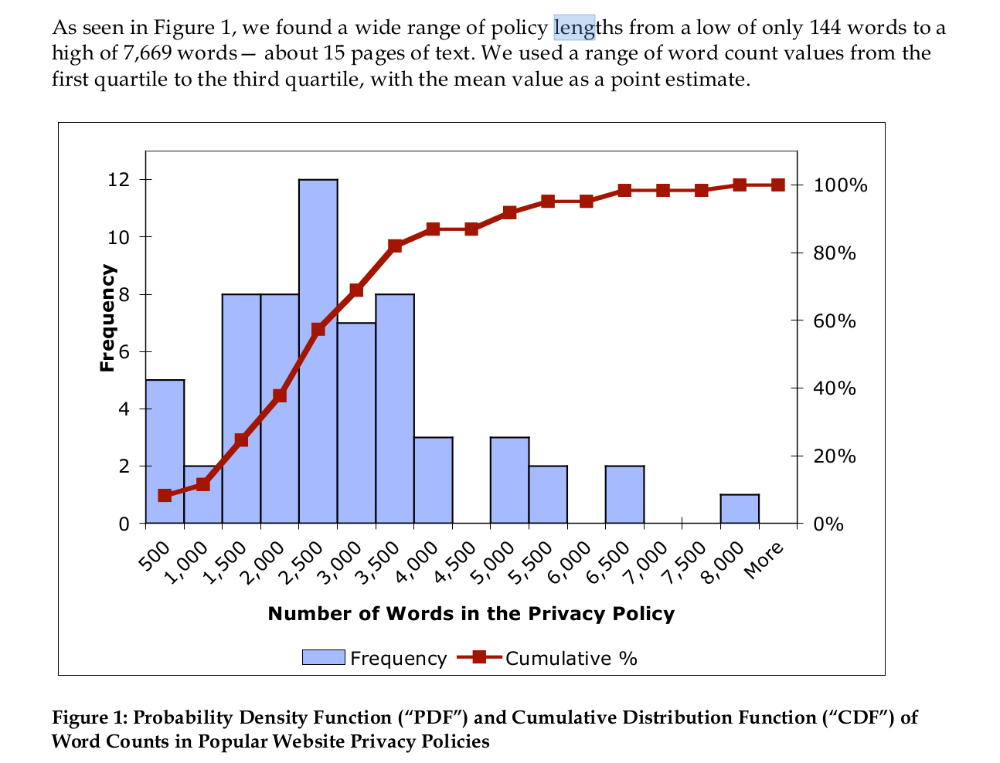
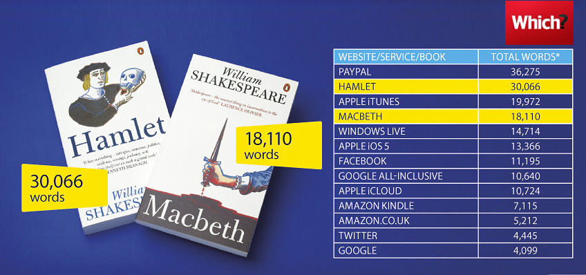
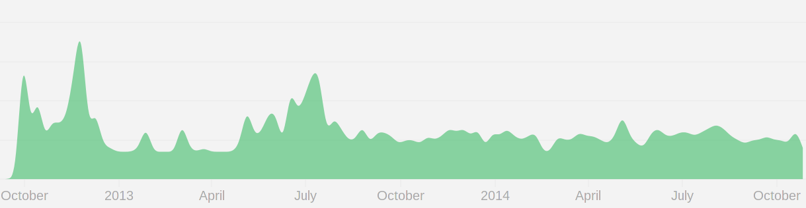
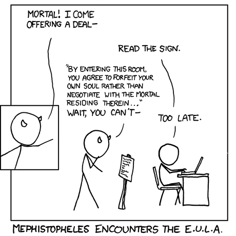
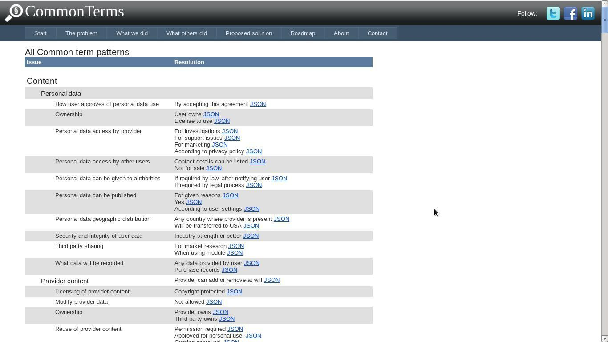
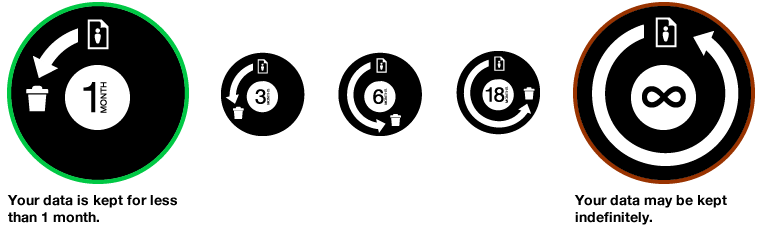
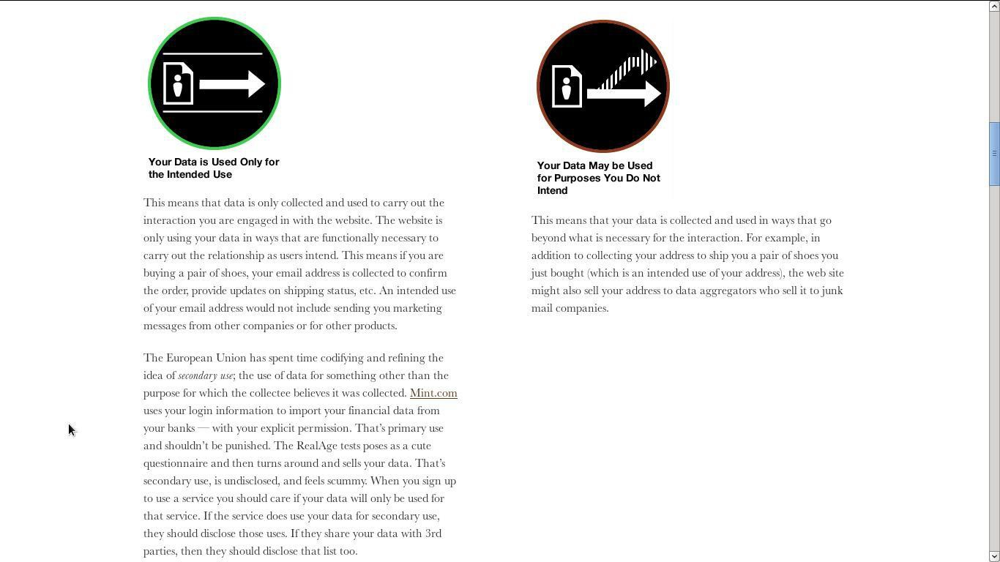
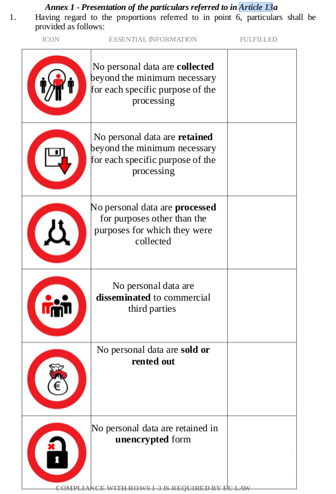
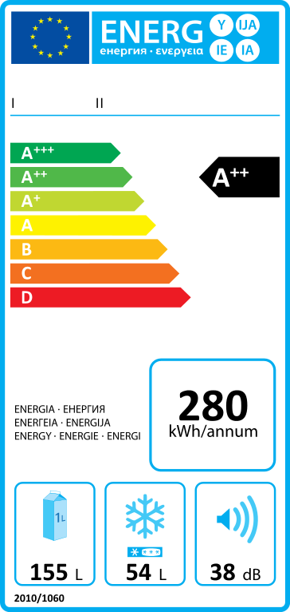
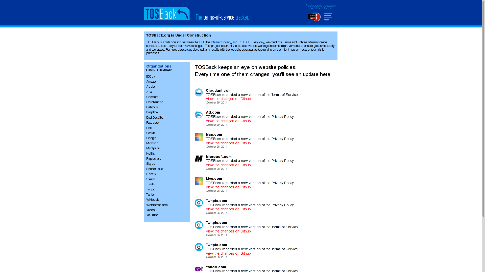

<aside class="notes">
A study from 2008 from Lorrie Cranor demonstrates that it would take each individual 76 days of work every year to read the applicable privacy policies online. 

This does not even take into account terms of service, but just privacy policies!

You shouldn't have to be a full time lawyer to have a basic idea about your rights online.
</aside>

---

<aside class="notes">
So, what happens next time you think about the problem of terms of service? How are you going to spend your 40 minutes of reading every day, comfortably sitting on your sofa?

Here's your choice: Apple's iTunes terms of service or William Shakespeare's Hamlet.

My advice: Hamlet is shorter.
</aside>

---

## ② Terms of Service change All–The–Time!

<aside class="notes">
That's from a sample of about 1000 websites. You can see that terms and privacy policies change *every single day*.
</aside>

---

> **We may revise these Terms from time to time**, the most current version will always be at twitter.com/tos. If the revision, **in our sole discretion**, is material we will notify you via an @Twitter update or e-mail to the email associated with your account. By continuing to access or use the Services after those revisions become effective, you agree to be bound by the revised Terms.
 
<aside class="notes">

</aside>

---

> GitHub reserves the right to update and change the Terms of Service from time to time **without notice**.

<aside class="notes">
without notice
</aside>

---

> [Couchsurfing] may change the provisions of this Privacy Policy from time to
time. If we make changes, we will notify you, including **by revising
the date at the top of this policy**. We encourage you to review the
Privacy Policy whenever you use our Services to stay informed about
our information practices and the ways you can help protect your
privacy.

<aside class="notes">
they say they will notify us… by putting a date on the page.
</aside>

---

> (Netflix) As we update and expand our services, we may make changes to this policy. **You should check back for updates to this policy from time to time. **You acknowledge that your assent to the Terms of Use and Privacy Policy subsequent to any changes made following your initial consent as well as, your use of the Netflix website or continued use of our service after our posting of changes to this policy, means that you agree to be bound by such changes.

<aside class="notes">
So, like Netflix says, we have to go check the page here and then.
</aside>

---

<figure>
<video src="src/FacebookPrivacyChanges.webm" autoplay loop></video><figcaption>Screencast from <a href="http://mattmckeon.com/facebook-privacy/">http://mattmckeon.com/facebook-privacy/</a></figcaption>
</figure>

<aside class="notes">
A lot of services have changed their terms of service for the worse. 

Instagram completely changed its terms to ask for a broad, nearly unlimited copyright license on users' photos --- after Facebook acquired them.

Twitter also changed their copyright license in 2009 to something nearly unlimited. Often, they include the right to grant sublicenses or to transfer the license, without limitation for what's necessary to provide the service.
</aside>

# How can we fix this problem?

---

## Enforcing your rights in courts

<aside class="notes">
Some of you might probably say that some of the provisions I have shown you could be strike down in courts. Maybe.

But first:

 1. Having to go to litigation is already a failure. Harm has been done.
    Contracts should ease relationships instead of being fundamentally broken
    in a way that a party always has to go to courts.

 2. This is a global problem. Courts in different jurisdictions under different
    laws may come to different conclusions regarding these practices,
    especially about whether changing terms without notifying users is
    acceptable or not.

 3. And sometimes, even when companies have been fined for practices that have
    been considered illegal, they have still succeeded in profiting from their
    actions.
</aside>

---

But wait, which courts?

---

> The Court of Santa Barbara in California is the only one competent for disputes arising from the terms of service of Youtube. The applicable law to these terms of service is the one of the State of California. 

<aside class="notes">
Let's go to California to enforce my rights. Meh, no.
</aside>
---

> <small>“You and Netflix agree that any dispute, claim or controversy arising out of or relating in any way to the Netflix service, including our website, user interfaces, these Terms of Use and this Arbitration Agreement, shall be determined by binding arbitration instead of in courts of general jurisdiction. Arbitration is more informal than a lawsuit in court. Arbitration uses a neutral arbitrator instead of a judge or jury, allows for more limited discovery than in court, and is subject to very limited review by courts. Arbitrators can award the same damages and relief that a court can award. You agree that, by agreeing to these Terms of Use, the U.S. Federal Arbitration Act governs the interpretation and enforcement of this provision, and that you and Netflix are each waiving the right to a trial by jury or to participate in a class action. This arbitration provision shall survive termination of this Agreement and the termination of your Netflix membership. YOU AND NETFLIX AGREE THAT EACH MAY BRING CLAIMS AGAINST THE OTHER ONLY IN YOUR OR ITS INDIVIDUAL CAPACITY, AND NOT AS A PLAINTIFF OR CLASS MEMBER IN ANY PURPORTED CLASS OR REPRESENTATIVE PROCEEDING.”</small>

More on arbitration: <http://blog.tosdr.org/posts/hannah-on-arbitration/>

---

## Fix it **before** it's too late!

<aside class="notes">
If we have to go to courts, then it's already too late!

</aside>

---

<aside class="notes">
Complex Natural Language Processing. Creating databases to find common patterns and to make an ontology of terms, to classify them.

Problem: this is hard!
</aside>

---

## Design is fundamental

---

<aside class="notes">
Data retention period: kind of easy to make an icon… 
</aside>

---

<aside class="notes">
But ToS deal with complex matters. Sometimes an icon just doesn't cut it. It's not worth it if it's as complicated to understand a set of icons than it is to read terms. Only the designer of that icon will understand.
</aside>

---

<aside class="notes">
The European Commission is revisiting the regulation on data protection. In the current version, there's this proposal of standardised icons. It's a good intention, but I'm sceptical this will work out.
</aside>

---

<aside class="notes">
ToS;DR is a community of people who share their review of terms. So when one persons reads the terms of one service, other people benefit.

Then, we codify that review and we design it in a way that gives the most important information first.
</aside>

---

---

---

<aside class="notes">
Install the browser extension!</aside>

---

<aside class="notes">
Github
</aside>

---

# Thank you  for joining!

And thanks to Andreas from Mozilla London for hosting us!

Follow up, contact me by

<mailto:hugo@ToSDR.org>

