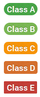

---
title: "ToS;DR: Behind the scenes"
author: Hugo Roy
date: |
    2014-11-05 

    @MozLDN  @ToSDR  #fixingTheBiggestLie
...

How does ToS;DR work?

# Reviews

## Step 1

Somebody reads the terms and shares what s/he finds out with the community.

(Right now, by sending an email to <tosdr@googlegroups.com> but we're making a web interface to replace that: <https://tosdr.org/submit-point.html>)

-----

A “point” is data describing one particular aspect of terms of service. All terms of service reviews are broken down into several points, so we can discuss each point.

## Step 2

The community discusses the review publicly.

(Right now, on the mailing list, but we're working on a web interface to replace that: <https://tosdr.org/pendingpoints.html>)

## Step 3

A moderator checks the discussion and moves the data to the website, once the point is mature enough.

----

Each point has:

  - Title
  - Good / Neutral / Bad / Blocker
  - a “TL;DR” (a plain-English summary)
  - a topic
  - a score from 0 to 100

## Step 4

Once a service has enough data points, it gets a Class.

## Points' score

The more a point has a big score, the more weight it has on the overall class of a service.

(Neutral points don't influence the class).

# Code

-----

<https://github.com/tosdr/>

## Submit Point

<https://tosdr.org/submit-point.html>

## Pending Points

<https://tosdr.org/pendingpoints.html>

## Firefox extension

<https://github.com/tosdr/tosdr-firefox/>

---------

IRC

freenode

\#tosdr

